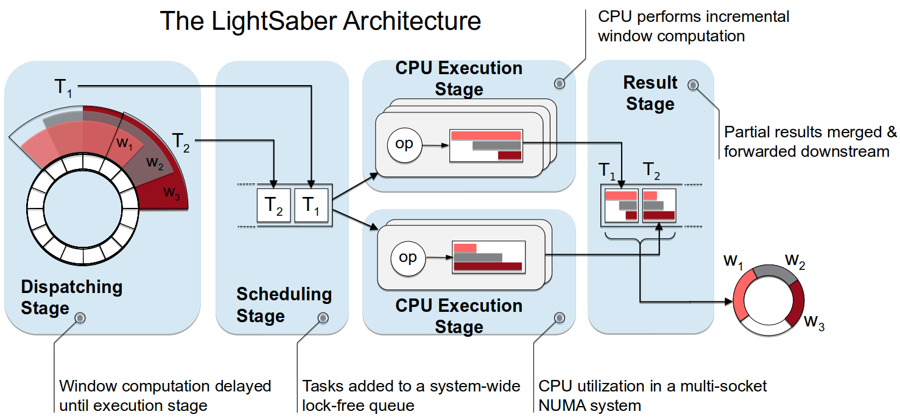
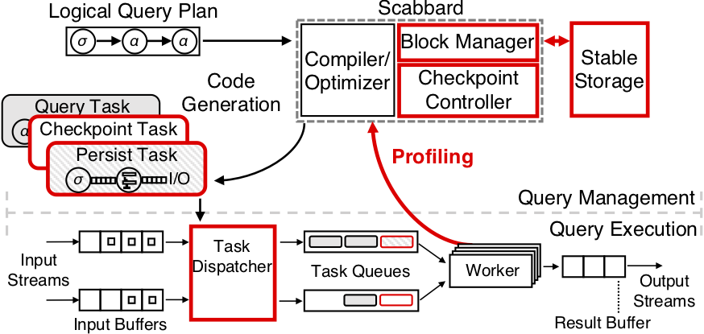

<div align="center">

</div>

[](https://github.com/lsds/LightSaber/blob/master/LICENCE.md)
# Introduction 

As an ever-growing amount of data is acquired and analyzed in real-time, stream processing engines have become an essential part of any data processing stack. Given the importance of this class of applications, modern stream processing engines must be designed specifically for the efficient execution on multi-core CPUs. However, it is challenging to analyze conceptually infinite data streams with high throughput and low latency performance while providing fault-tolerance semantics.
This project offers two systems to help tackle this problem.


## LightSaber 

LightSaber is a stream processing engine that balances parallelism and incremental processing when executing window aggregation queries
on multi-core CPUs. LightSaber operates on in-order data streams and achieves up to an order of magnitude higher throughput than existing systems.

See application examples and how to configure LightSaber [here](#running-lightsaber).

<div align="center">

</div>


## Scabbard 
Scabbard is the first single-node SPE that supports exactly-once fault-tolerance semantics despite limited local I/O bandwidth.
It tightly couples the persistence operations with the operator graph through a novel persistent operator graph model and
dynamically reduces the required disk bandwidth at runtime through adaptive data compression.
Scabbard is based on the query execution engine and compiler from LightSaber.

See application examples and how to configure Scabbard [here](#running-scabbard).

<div align="center">

</div>

## Getting started

The `prepare-software.sh` script will guide you through the installation of our system locally.
The script is tested on **Ubuntu 18.04.5 LTS**. If an error occurs, you may have to manually 
remove and add the symbolic links of the compiler binaries in `/usr/lib/ccache/`.

```
$ git clone https://github.com/lsds/LightSaber.git
$ cd LightSaber
$ ./scripts/prepare-software.sh
$ ./scripts/build.sh
```

Otherwise, use the Dockerfile:
```
$ git clone https://github.com/lsds/LightSaber.git
$ cd LightSaber
$ docker build --tag="lightsaber" .
$ docker run -ti lightsaber
```

### Setting up variables before running the code
When running a query, the **LightSaber system is used by default**.
**To enable the features of Scabbard, we have to set the variables defined [here](#scabbard-configuration)**.

Skip the next part if you don't want to change the folder where code/data is stored, and you have
installed LLVM in the `$HOME` directory.

Before running any query, set the path (the default is the `$HOME` directory) where files are stored in the 
SystemConf.cpp file:
```
SystemConf::FILE_ROOT_PATH = ...
```
and the path for LLVM/Clang source files in src/CMakeLists (the default is the `$HOME` directory):
```
set(USER_PATH "...")
```

### Adding new applications
When compiling in `Release` mode, add the `-UNDEBUG` flag in the `CMakeLists.txt` to enable `assert`:
```
target_compile_options(exec ... -UNDEBUG)
```

### Start with unit tests
```
$ ./build/test/unit_tests/ds_unit_tests
$ ./build/test/unit_tests/internals_unit_tests
$ ./build/test/unit_tests/operators_unit_tests           
``` 

## Running LightSaber

### Running a microbenchmark (e.g., Projection)
```
$ ./build/test/benchmarks/microbenchmarks/TestProjection
```

### Running a cluster monitoring application with sample data
```
$ ./build/test/benchmarks/applications/cluster_monitoring
```

### Running benchmarks from the paper
You can find the results in `build/test/benchmarks/applications/`.
```
$ cd scripts/lightsaber-bench
$ ./run-benchmarks-lightsaber.sh
```

### LightSaber configuration

Variables in **SystemConf.h** configure the LightSaber runtime. Each of them also corresponds to a command-line argument available to all LightSaber applications:

###### --threads _N_
Sets the number of CPU worker threads (`WORKER_THREADS` variable). The default value is `1`. **CPU worker threads are pinned to physical cores**. The threads are pinned to core ids based on the underlying hardware (e.g., if there are multiple sockets with n cores each, the first n threads are pinned in the first socket and so on).

###### --batch-size _N_
Sets the batch size in bytes (`BATCH_SIZE` variable). The default value is `131072`, i.e. 128 KB.

###### --bundle-size _N_
Sets the bundle size in bytes (`BUNDLE_SIZE` variable), which is used for generating data in-memory.
It has to be a multiple of the `BATCH_SIZE`. The default value is `131072`, i.e. 128 KB, which is the same as the `BATCH_SIZE`.

###### --slots _N_
Sets the number of intermediate query result slots (`SLOTS` variable). The default value is `256`.

###### --partial-windows _N_
Sets the maximum number of window fragments in a query task (`PARTIAL_WINDOWS` variable). The default value is `1024`.

###### --circular-size _N_
Sets the circular buffer size in bytes (`CIRCULAR_BUFFER_SIZE` variable). The default value is `4194304`, i.e. 4 MB.

###### --unbounded-size _N_
Sets the intermediate result buffer size in bytes (`UNBOUNDED_BUFFER_SIZE` variable). The default value is `524288`, i.e. 512 KB.

###### --hashtable-size _N_
Hash table size (in number of buckets): hash tables hold partial window aggregate results (`HASH_TABLE_SIZE` variable with the default value 512).

###### --performance-monitor-interval _N_
Sets the performance monitor interval in msec (`PERFORMANCE_MONITOR_INTERVAL` variable).
The default value is `1000`, i.e. 1 sec. Controls how often LightSaber prints on standard output performance statistics such as throughput and latency.

###### --latency `true`|`false`
Determines whether LightSaber should measure task latency or not (`LATENCY_ON` variable). The default value is `false`.

###### --parallel-merge `true`|`false`
Determines whether LightSaber uses parallel aggregation when merging fragment windows or not (`PARALLEL_MERGE_ON` variable). The default value is `false`.

###### To enable NUMA-aware scheduling

Set the `HAVE_NUMA` flag in the respective CMakeLists.txt (e.g., in `test/benchmarks/applications/CMakeLists.txt`) and recompile the code.

###### To ingest/output data with TCP

Set the `TCP_INPUT`/`TCP_OUTPUT` flag in the respective CMakeLists.txt (e.g., in `test/benchmarks/applicationsWithCheckpoints/CMakeLists.txt`) and recompile the code.
Check the `test/benchmarks/applications/RemoteBenchmark` folder for code samples to create TCP sources/sinks.

###### To ingest/output data with RDMA

Set the `RDMA_INPUT`/`RDMA_OUTPUT` flag in the respective CMakeLists.txt (e.g., in `test/benchmarks/applicationsWithCheckpoints/CMakeLists.txt`) and recompile the code.
Check the `test/benchmarks/applications/RemoteBenchmark` folder for code samples to create RDMA sources/sinks.


## Running Scabbard

### Running a microbenchmark (e.g., Aggregation) with persistent input streams and 1-sec checkpoints
```
$ ./build/test/benchmarks/microbenchmarks/TestPersistentAggregation
```

### Running a cluster monitoring application with persistence using sample data
```
$ ./build/test/benchmarks/applicationsWithCheckpoints/cluster_monitoring_checkpoints --circular-size 33554432 --unbounded-size 524288 --batch-size 524288 --bundle-size 524288 --query 1 --checkpoint-duration 1000 --disk-block-size 65536 --checkpoint-compression true --persist-input true --lineage true --latency true --threads 1
```

### Running benchmarks from the paper 
You can find the results in `build/test/benchmarks/applicationsWithCheckpoints/`.
```
$ cd scripts/scabbard-bench/paper/
$ ./run-benchmarks-...-FIG_X.sh
```

### Scabbard configuration

In addition to [LightSaber's system variables](#lightsaber-configuration), we can configure the Scabbard runtime with variables specific its fault-tolerance semantics.
Each of them also corresponds to a command-line argument available to all Scabbard applications:

###### --compression-monitor-interval _N_
Sets the query compression decision update interval in msec (`COMPRESSION_MONITOR_INTERVAL` variable). The default value is `4000` i.e. 4 sec.

###### --checkpoint-duration _N_
Sets the performance monitor interval in msec (`CHECKPOINT_INTERVAL` variable). The default value is `1000`, i.e. 1 sec.

###### --disk-block-size _N_
Sets the size of blocks on disk in bytes (`BLOCK_SIZE` variable). The default value is `16KB`.

###### --create-merge `true`|`false`
Determines whether Scabbard is generating merge tasks to avoid resource starvation due to asynchronous execution (`CREATE_MERGE_WITH_CHECKPOINTS` variable). The default value is `false`.

###### --checkpoint-compression `true`|`false`
Determines whether Scabbard is compressing data before storing them to disk (`CHECKPOINT_COMPRESSION` variable). The default value is `false`.

###### --persist-input `true`|`false`
Determines whether Scabbard persists its input streams (`PERSIST_INPUT` variable). The default value is `false`.

###### --lineage `true`|`false`
Enables dependency tracking required for exaclty-once results (`LINEAGE_ON` variable). The default value is `false`.

###### --adaptive-compression `true`|`false`
Enables adaptive compression (`ADAPTIVE_COMPRESSION_ON` variable). The default value is `false`.

###### --adaptive-interval _N_
Sets the interval in msec that triggers the code generation of new compression functions based on collected statistics (`ADAPTIVE_COMPRESSION_INTERVAL` variable). The default value is `4000`, i.e. 4 sec.

###### --recover `true`|`false`
If set true, Scabbard attempts to recover using previous persisted data (`RECOVER` variable). The default value is `false`.


## How to cite Scabbard
* **[VLDB]** Georgios Theodorakis, Fotios Kounelis, Peter R. Pietzuch, and Holger Pirk. Scabbard: Single-Node Fault-Tolerant Stream Processing, VLDB, 2022
```
@inproceedings{Theodorakis2022,
 author = {Georgios Theodorakis and Fotios Kounelis and Peter R. Pietzuch and Holger Pirk},
 title = {{Scabbard: Single-Node Fault-Tolerant Stream Processing}},
 series = {VLDB '22},
 year = {2022}, 
 publisher = {ACM},
}
```

## How to cite LightSaber
* **[SIGMOD]** Georgios Theodorakis, Alexandros Koliousis, Peter R. Pietzuch, and Holger Pirk. LightSaber: Efficient Window Aggregation on Multi-core Processors, SIGMOD, 2020
```
@inproceedings{Theodorakis2020,
 author = {Georgios Theodorakis and Alexandros Koliousis and Peter R. Pietzuch and Holger Pirk},
 title = {{LightSaber: Efficient Window Aggregation on Multi-core Processors}},
 booktitle = {Proceedings of the 2020 ACM SIGMOD International Conference on Management of Data},
 series = {SIGMOD '20},
 year = {2020}, 
 publisher = {ACM},
 address = {Portland, OR, USA},
}
```

### Other related publications
* **[EDBT]** Georgios Theodorakis, Peter R. Pietzuch, and Holger Pirk. SlideSide: A fast Incremental Stream Processing Algorithm for Multiple Queries, EDBT, 2020
* **[ADMS]** Georgios Theodorakis, Alexandros Koliousis, Peter R. Pietzuch, and Holger Pirk. Hammer Slide: Work- and CPU-efficient Streaming Window Aggregation, ADMS, 2018 [[code]](https://github.com/grtheod/Hammerslide)
* **[SIGMOD]** Alexandros Koliousis, Matthias Weidlich, Raul Castro Fernandez, Alexander Wolf, Paolo Costa, and Peter Pietzuch. Saber: Window-Based Hybrid Stream Processing for Heterogeneous Architectures, SIGMOD, 2016


